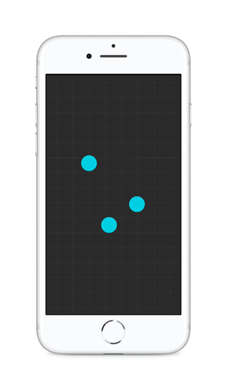

# Pinch-zoom prototype using Origami Studio

Microinteraction test of Origami Studio. This prototype simulates the scaling of a map as you pinch/spread two fingers on the screen. Pins merge the further you zoom out.

